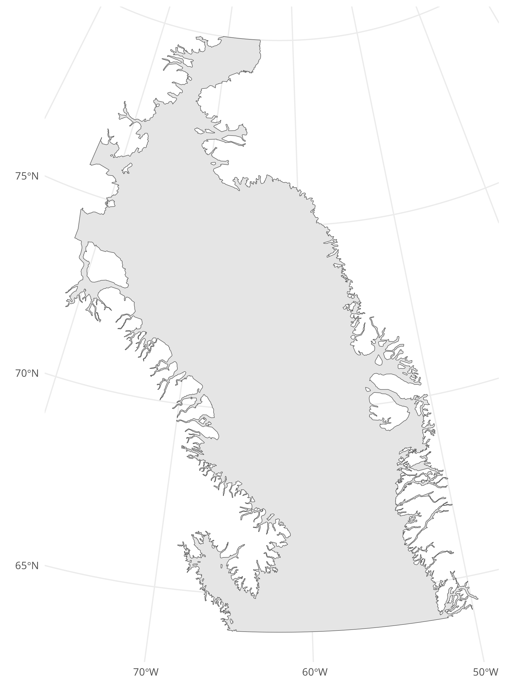

# Polygon of Baffin Bay

Code to create a polygon that covers Baffin Bay. Will be useful for many projects where spatial analysis are involved. The *overall* polygon was made with <https://geojson.io> and exported into a geojson file.

